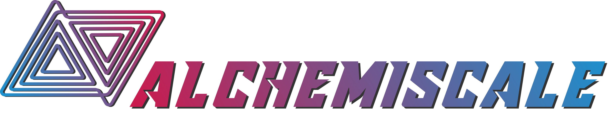

---

**alchemiscale**: a high-throughput alchemical free energy execution system for use with HPC, cloud, bare metal, and Folding@Home

---

alchemiscale logo by Jenke Scheen is marked with <a href="http://creativecommons.org/publicdomain/zero/1.0?ref=chooser-v1" target="_blank" rel="license noopener noreferrer" style="display:inline-block;">CC0 1.0</a>
 
