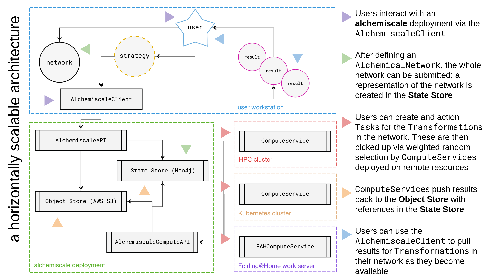

.. _developer-guide:

###############
Developer Guide
###############

``alchemiscale`` is an open-source project, and we invite developers to contribute to its advancement and to extend its functionality.
This document provides some guidance on:

* the system architecture, guiding philosophy for design choices
* components and their technology stacks
* the overall layout of the library
* how best to engage with the project

.. _system-architecture:

*****************************************
System architecture and design philosophy
*****************************************

``alchemiscale`` is an example of a `service-oriented architecture`_, with the following components:

* the system state represented in a graph database (`Neo4j`_), often referred to as the *state store*
* result objects (e.g. files) stored in an *object store*, such as `AWS S3`_
* user access to the *state store* and *object store* via a `RESTful`_ API (``AlchemiscaleAPI``), often using the included Python client (:py:class:`~alchemiscale.interface.client.AlchemiscaleClient`)
* compute services deployed to resources suitable for performing free energy calculations, typically with `GPUs`_ for simulation acceleration
* another `RESTful`_ API (``AlchemiscaleComputeAPI``) used by the compute services for interaction with the *state store* and *object store*

These components function together to create a complete ``alchemiscale`` deployment.
They are shown together visually in :numref:`system-architecture-figure`.

.. _system-architecture-figure:

   Diagram of the system architecture for ``alchemiscale``.
   Colored arrows on the diagram correspond to descriptions on the right.

.. _service-oriented architecture: https://en.wikipedia.org/wiki/Service-oriented_architecture
.. _Neo4j: https://neo4j.com/
.. _AWS S3: https://aws.amazon.com/s3/
.. _GPUs: https://en.wikipedia.org/wiki/Graphics_processing_unit
.. _RESTful: https://en.wikipedia.org/wiki/Representational_state_transfer

********************************
Components and technology stacks
********************************

Each component of ``alchemiscale`` makes use of an underlying technology stack specifically oriented to that component's purpose and needs.
We detail these components in this section.

.. _component-state-store:

State store
===========

The *state store* for ``alchemiscale`` represents the current state of the system at all times, without regard to the state of any other component.
It represents the single source of truth for what exists and what does not in the deployment, the status of running calculations, available results, etc.
Other components can experience failures and faults, but the content of the *state store* is the only content that really matters at any given moment.

We use a `graph database`_, `Neo4j`_, as the *state store*.
The choice of a graph database (over e.g. a `relational database`_ or a `document database`_) was natural given the graph structure of :external+gufe:py:class:`~gufe.network.AlchemicalNetwork`\s,
which constitute the core data model ``alchemiscale`` operates on.
With Neo4j, it wasn't necessary to contort these networks into relational tables or into loosely-related document records, and we can take advantage of deduplication of network nodes where appropriate for database performance and efficient use of compute resources.

The :py:class:`~alchemiscale.storage.statestore.Neo4jStore` class is ``alchemiscale``'s interface to its Neo4j instance, and broadly defines the interaction points for the *state store*.
The methods on this class interact with Neo4j via `py2neo`_, a client library that features a flexible object model for defining complex networks in Python and representing them in Neo4j.
Neo4j itself uses `Cypher`_ as its query language, and this is used throughout the :py:class:`~alchemiscale.storage.statestore.Neo4jStore` for modifying the state of the nodes and edges in the database.
It is worth reviewing the `Cypher manual`_ if you wish to make contributions to ``alchemiscale`` that require new interactions with the *state store*.

.. _graph database: https://en.wikipedia.org/wiki/Graph_database
.. _relational database: https://en.wikipedia.org/wiki/Relational_database
.. _document database: https://en.wikipedia.org/wiki/Document-oriented_database

.. _py2neo: https://github.com/py2neo-org/py2neo
.. _Cypher: https://en.wikipedia.org/wiki/Cypher_(query_language)
.. _Cypher manual: https://neo4j.com/docs/cypher-manual/current/introduction/

.. _component-object-store:

Object store
============

The *object store* is used for result storage.
Execution of :py:class:`~alchemiscale.storage.models.Task`\s by :ref:`component-compute-services` yields :external+gufe:py:class:`~gufe.protocols.protocoldag.ProtocolDAGResult` objects, and these are stored
in a directory-like structure within the *object store* for later retrieval.
References to these objects are created in the *state store*, allowing the *state store* to function as a fast index for finding individual results on request.
When a user makes use of the :py:class:`~alchemiscale.interface.client.AlchemiscaleClient` to request results for a given :external+gufe:py:class:`~gufe.transformations.transformation.Transformation`, the ``AlchemiscaleAPI`` queries the *state store* for these references, then pulls the corresponding results from the *object store* and returns them as responses to the request.

The choice of *object store* corresponds to the platform ``alchemiscale`` is being deployed to.
Currently, there is only one implementation, using `AWS S3`_ as the *object store*, but there are plans to create implementations appropriate for other cloud providers, as well as to provide a "local" *object store* for single-host deployments.

For the `AWS S3`_ *object store*, ``alchemiscale`` makes use of :py:class:`~alchemiscale.storage.objectstore.S3ObjectStore` as its interface.
This object provides methods for storing and retrieving :external+gufe:py:class:`~gufe.protocols.protocoldag.ProtocolDAGResult`\s, and over time will support methods for storage of arbitrary files as required by certain :external+gufe:py:class:`~gufe.protocols.protocol.Protocol`\s.

.. _component-apis:

RESTful APIs
============

A complete ``alchemiscale`` deployment (currently) features two `RESTful`_ APIs, which handle `HTTP`_ client requests:

* ``AlchemiscaleAPI``: handles requests from *user* identities; includes submitting :external+gufe:py:class:`~gufe.network.AlchemicalNetwork`\s, actioning ``Task``\s, and retrieving results
* ``AlchemiscaleComputeAPI``: handles requests from *compute* identities; includes claiming ``Task``\s, submitting results on completion or failure

All API services in ``alchemiscale`` are implemented via `FastAPI`_, and deployed as `Gunicorn`_ applications with `Uvicorn`_ workers.
These services are "stateless": they modify the state of the *state store* and *object store*, but the state of the service workers themselves is ephemeral and relatively disposable.
Workers can be scaled up or scaled down to handle more or fewer requests from clients, but this has no bearing on the overall state of the ``alchemiscale`` deployment.

By construction, these API services can be horizontally scaled across many physical servers, and need not be co-located with the *state store*.
This is the approach taken, for example, when deploying to Kubernetes via `alchemiscale-k8s`_.

.. _HTTP: https://en.wikipedia.org/wiki/HTTP
.. _FastAPI: https://en.wikipedia.org/wiki/HTTP
.. _Gunicorn: https://docs.gunicorn.org/en/latest/custom.html
.. _Uvicorn: https://www.uvicorn.org/

.. _alchemiscale-k8s: https://github.com/datryllic/alchemiscale-k8s

.. _component-user-client:

User-facing Python client
=========================

Users interact with an ``alchemiscale`` deployment via the Python client :py:class:`~alchemiscale.interface.client.AlchemiscaleClient`.
This client allows users to directly use `Open Free Energy`_ ecosystem tools to define :external+gufe:py:class:`~gufe.network.AlchemicalNetwork`\s, then submit, execute, and retrieve results for those networks via ``alchemiscale``, all from within a single Python session.

The client methods convert Pythonic user input into HTTP requests to the ``AlchemiscaleAPI``, which services those requests and issues responses, which are then converted by the client back into Pythonic objects.
The client automatically handles authentication, including `JWT`_ retrieval and refreshes, as well as retries due to unreliable network connections, overloaded or temporarily-unreachable API services, etc.
Some methods also make use of `asyncio`_ for requesting many entities in concurrent calls, and/or performs batching of calls for many entities.
Internally, the `requests`_ and `httpx`_ libraries are used for making HTTP requests, for synchronous and asynchronous calls, respectively.

Although it is possible to interact with the ``AlchemiscaleAPI`` with requests using any HTTP client, including e.g. `curl`_, this is not generally recommended for users.

.. _Open Free Energy: https://openfree.energy/
.. _JWT: https://en.wikipedia.org/wiki/JSON_Web_Token 
.. _asyncio: https://docs.python.org/3/library/asyncio.html
.. _requests: https://docs.python-requests.org/en/latest/index.html
.. _httpx: https://www.python-httpx.org/
.. _curl: https://en.wikipedia.org/wiki/CURL

.. _component-compute-services:

Compute services
================

Compute services are deployed and run on resources suitable for executing actual free energy calculations.
They are not considered part of the "server" deployment, which includes the *state store*, the *object store*, and the API services.
Compute services are designed to be run independently of one another, and function as clients to the ``AlchemiscaleComputeAPI``.

There currently exists a single implementation of an ``alchemiscale`` compute service: the :py:class:`~alchemiscale.compute.service.SynchronousComputeService`.
This functions as the reference implementation; other variants will likely be created in the future, optimized for different use cases.
The discussion that follows describes the behavior of compute services in general, and should apply to all variants.

When a compute service is started, it consumes a configuration file for setting its parameters, such as `this template configuration`_ for the :py:class:`~alchemiscale.compute.service.SynchronousComputeService`, 
This file sets the URL for the target ``alchemiscale`` instance, compute identity and key, and any parameters specific to the resource on which the compute service is deployed.
See :ref:`compute` for additional details on deployment.

After starting up, the compute service registers itself with the ``AlchemiscaleComputeAPI``, creating a :py:class:`~alchemiscale.storage.models.ComputeServiceRegistration` instance in the *state store*.
It will then claim :py:class:`~alchemiscale.storage.models.Task`\s for execution, pull the corresponding :external+gufe:py:class:`~gufe.transformations.transformation.Transformation`, create and execute a :external+gufe:py:class:`~gufe.protocols.protocoldag.ProtocolDAG`, and push the corresponding :external+gufe:py:class:`~gufe.protocols.protocoldag.ProtocolDAGResult` back to the ``AlchemiscaleComputeAPI`` upon completion or failure.
The compute service will continue this behavior until it reaches a configured stop condition, receives a termination signal, or is killed.

The compute service periodically issues a heartbeat to the ``AlchemiscaleComputeAPI``, updating its last known heartbeat datetime in its registration.
If the compute service is killed without a chance to deregister itself, its heartbeat won't be updated, and eventually the registration will be expired and deregistered by the ``AlchemiscaleComputeAPI``.
If the compute service reaches a configured stop condition or receives a termination signal, it will cease execution, deregister itself, and shut down.
Deregistration automatically unclaims any ``"running"`` ``Task``\s and sets their status back to ``"waiting"``.

Compute services make use of the :py:class:`~alchemiscale.compute.client.AlchemiscaleComputeClient` for issuing all requests and handling responses from the ``AlchemiscaleComputeAPI``.
This is directly analogous to the way users interact with ``alchemiscale`` via the :py:class:`~alchemiscale.interface.client.AlchemiscaleClient` through the ``AlchemiscaleAPI``.
Like the ``AlchemiscaleClient``, the ``AlchemiscaleComputeClient`` automatically handles authentication and JWT refreshes, retries, etc.

.. _this template configuration: https://github.com/OpenFreeEnergy/alchemiscale/blob/main/devtools/configs/synchronous-compute-settings.yaml

.. _library-layout:

**************
Library layout
**************

The ``alchemiscale`` codebase is generally organized according to the components detailed above.
At the top level of the source tree, we have:

``models``
    common ``alchemiscale`` data models, in particular :py:class:`~alchemiscale.models.Scope` and :py:class:`~alchemiscale.models.ScopedKey`

``settings``
    settings data models for configurable components

``cli``
    command-line interface, implemented via `click`_

``storage``
    *state store* and *object store* interfaces, along with relevant data models; not user-facing

``base``
    base classes and common components for RESTful APIs, HTTP clients

``interface``
    user-facing ``AlchemiscaleClient`` and ``AlchemiscaleAPI`` definitions

``compute``
    compute-facing ``AlchemiscaleComputeClient`` and ``AlchemiscaleComputeAPI``, as well as compute service classes

``security``
    data models and methods for defining credentialed identities and authenticating them, implementation of JWT via `jose`_

``tests``
    integration and unit test suite; implemented via `pytest`_, and utilizes Docker via `grolt`_ for Neo4j testing
    
Other modules, such as ``strategist`` and ``strategies``, are currently placeholders for future functionality.

See the :ref:`api-reference` for the detailed contents of each of these modules.

.. _click: https://click.palletsprojects.com/
.. _jose: https://github.com/mpdavis/python-jose
.. _pytest: https://docs.pytest.org
.. _grolt: https://github.com/py2neo-org/grolt

.. _contributing:

*****************
How to contribute
*****************

Interested in helping to develop ``alchemiscale``?
The project is `developed openly on GitHub`_, and the best way to get started is to introduce yourself in our `New Contributors`_ Discussions tab.
We can help orient you to problems aligned with your interests and skills from there!

Before you start work on a new feature, it's a good practice to first `open an issue`_ describing it.
This allows the maintainers to respond to your desired feature and offer guidance on how to go about implementing it, or whether it is within scope of the project's vision.
It may be that the feature you are after already exists in some form, isn't really possible given ``alchemiscale``'s architecture, or isn't actually desirable for one or more reasons.
Starting the discussion in an issue is likely to save you time, energy, and possibly frustration, so please take a moment to describe what you are after before working to implement it.
The issue also functions as a convenient *anchor point* for maintainers to triage feature requests, perhaps grouping them with others in an `upcoming milestone`_.

If the feature is of broad interest, or of interest to the maintainers themselves, you may find you don't have to implement it at all!

.. _developed openly on GitHub: https://github.com/OpenFreeEnergy/alchemiscale
.. _New Contributors: https://github.com/OpenFreeEnergy/alchemiscale/discussions/categories/new-contributors
.. _open an issue: https://github.com/OpenFreeEnergy/alchemiscale/issues
.. _upcoming milestone: https://github.com/OpenFreeEnergy/alchemiscale/milestones

Setting up your development environment
=======================================

If you've decided to work on some aspect of ``alchemiscale``, the development workflow is roughly as follows.
It's recommended that you develop/test on a Linux host, as there are `known issues with developing on Mac`_.

To develop new features, fix bugs, and advance the ``alchemiscale`` codebase, you will need to:

1. Clone the repository to your local machine::

    $ git clone git@github.com:OpenFreeEnergy/alchemiscale.git
    $ cd alchemiscale

2. Create a conda environment for running the test suite, preferrably with `mamba`_, and activate it::

    $ mamba env create -n <environment-name> -f devtools/conda-envs/test.yml
    $ conda activate <environment-name>

3. Perform an editable install of the ``alchemiscale`` source tree::

    $ pip install -e .

4. Make changes to the codebase, add or modify tests where necessary, then run the test suite::

    $ pytest -v alchemiscale/tests

5. Address test failures. Once clear, commit your changes on a new branch::

    $ git checkout -b <feature-branch-name>
    $ git commit -a -m <commit-message>

6. Create a pull request (PR) from your own fork; this is easiest with the `GitHub CLI`_::

    $ gh pr create

Once your PR is up, a maintainer can review it and offer feedback.
It is unlikely that your PR will be merged immediately; it is often the case that changes will be requested to conform the feature to current patterns in the codebase, improve its maintainability, etc.
Please be patient, and understand that it may take some time (weeks, even months) between the time a PR is created, accepted, and merged.

.. _mamba: https://github.com/conda-forge/miniforge#mambaforge
.. _known issues with developing on Mac: https://github.com/OpenFreeEnergy/alchemiscale/issues/92
.. _GitHub CLI: https://cli.github.com/
