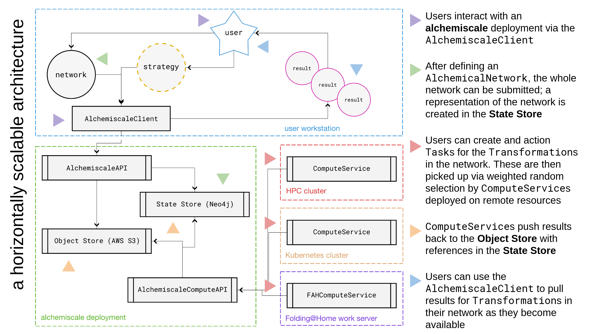

.. alchemiscale documentation master file, created by
   sphinx-quickstart on Wed Nov 23 20:51:04 2022.
   You can adapt this file completely to your liking, but it should at least
   contain the root `toctree` directive.

#######################################################################
alchemiscale: a high-throughput alchemical free energy execution system
#######################################################################

**alchemiscale** is a service-oriented execution system for ``AlchemicalNetworks``,
suitable for utilizing multiple compute resources,
such as HPC clusters, individual hosts, Kubernetes clusters, `Folding@Home`_ work servers, etc.,
to support large campaigns requiring high-throughput.

**alchemiscale** is designed for maximum interoperability with the `Open Molecular Software Foundation`_ stack,
in particular the `OpenForceField`_ and `OpenFreeEnergy`_ ecosystems. 
**alchemiscale** is fully open source under the permissive **MIT license**.

The overall architecture for **alchemiscale** is shown visually in :numref:`system-architecture-figure-overview`.
See the :ref:`user-guide` for details on what interaction with **alchemiscale** looks like from a user's perspective,
and the :ref:`developer-guide` for details on how the components of this architecture work together to execute free energy calculations and yield their results.

.. _system-architecture-figure-overview:

   Diagram of the system architecture for ``alchemiscale``.
   Colored arrows on the diagram correspond to descriptions on the right.

.. note::
   This software is pre-alpha and under active development. It is not yet ready
   for production use and the API is liable to change rapidly at any time. 

.. _Folding@Home: https://foldingathome.org
.. _Open Molecular Software Foundation: https://omsf.io
.. _OpenForceField: https://openforcefield.org
.. _OpenFreeEnergy: https://openfree.energy/

.. toctree::
   :maxdepth: 1
   :caption: Contents:

   ./user_guide
   ./deployment
   ./compute
   ./operations
   ./development
   ./api

Indices and tables
==================

* :ref:`genindex`
* :ref:`modindex`
* :ref:`search`
